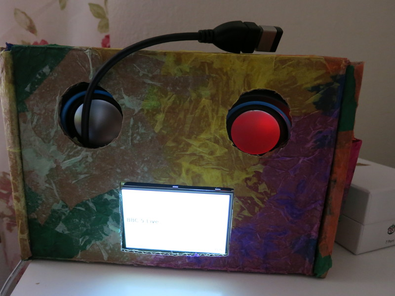
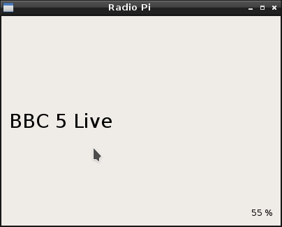

# radio-pi

This is a personal project to play radio stations designed to be working in a Raspberry Pi (event without X11 with framebuffer) but also works on a GNU/Linux (Debian, Ubuntu, etc.).

We've been using it for months almost daily. The UI/UX could be improved but it works as it is now.

If you want to use it: you might need some patience and might need some tweaking: this has only been used in two or three computers and only one Raspberry Pi, it's not setup for an easy installation.

If it works using a Raspberry Pi and TFT screen the final result looks like:



And a small remote control to control the software (I've considered and it's easy to add touch screen control but haven't done it yet).

To change the radio stations (it comes with a few already there) it's needed to edit a JSON file (some day we might do a Web backend to help on this).

## Basic Dependencies
* Qt 5
* mplayer
* Suggested: alsamixer

## Compile and use on a Desktop GNU/Linux
radio-pi needs Qt 5. Make sure that `qmake --version` returns Qt 5, e.g.:
```
QMake version 3.0
Using Qt version 5.7.1 in /usr/lib/x86_64-linux-gnu
```

For example in a Debian stretch it was needed to install qt5-default:
```
apt-get install qt5-default
```

To download and compile:
```
git clone https://github.com/cpina/radio-pi.git
cd radio-pi
qmake
make
```

## Use the application
In the same directory as the radio-pi there should be a directory named `configuration`. The cloned repository has a default configuration directory.

Executing `radio-pi` should appear a screen like:



The repository has a `configuration` directory with three files:
```
commands.json
keys.json
stations.json
```

### stations.json
[See example!](http://raw.githubusercontent.com/cpina/radio-pi/master/configuration/stations.json)

Defines the radio station number, the name to be displayed and the URL that will be used with `mplayer` to play this radio station.

Note that a "radio station" can execute a command (see the radio station 99). The command should exist in `commands.json` and is executed when the user presses this station.

### keys.json
[See example!](http://raw.githubusercontent.com/cpina/radio-pi/master/configuration/keys.json)

Defines the possible keys to react for the default actions:
 * change_station_up
 * change_station_down
 * volume_up
 * volume_down

Accepts an array that can contain strings following the [Qt::Key!](http://doc.qt.io/qt-5/qt.html#Key-enum) enum or integers (needed for when Qt doesn't have an Enum representation, for example for the remote control).

If the name of the keys is unknown execute `radio-pi`, select the window, press the key. In the output it would display:
```
==== key pressed: Qt::Key(Key_F7)
==== key pressed: Qt::Key(Key_Home)
==== key pressed: Qt::Key(Key_End)
```

Or a number - this are the names or numbers that can be used.

### commands.json
[See example!](https://raw.githubusercontent.com/cpina/radio-pi/master/configuration/commands.json)

To try to keep the software as general as possible the user can define which commands are used for a series of actions. This can be tested in the console, for example in:
```
{
	"volume_status": "amixer -M get Master",
	"power_off": "/home/carles/bin/write.sh",
	"set_volume": "amixer -M set Master %d%",
	"mute": "amixer -M set Master mute",
	"unmute": "amixer -M set Master unmute"
}
```

`set_volume` replaces %d by a number between 0 to 100. 


# Default configuration:
Arrow up/down to change stations up/down.
Arrow left/right to change the volume. Also the volume up/down in a remote control.

To power off correctly: we have that the channel 99 executes a script that is doing a "sudo halt" and this is our way to switch it off (note that we then use a switch by the plug to switch the power off).

## Crosscompile in a Desktop GNU/Linux to be used in a RaspberrPi
To setup the Debian "standard x86-64" environment for cross-compilation I followed:
https://wiki.qt.io/RaspberryPi2EGLFS

Note the step that I sometimes need to do again (because ~/raspi-qt in my system is a symbolic link to an external file system):

Go to Tools -> Options -> Build&Run -> Compilers
  Add
    GCC
    Compiler path: ~/raspi-qt/tools/arm-bcm2708/gcc-linaro-arm-linux-gnueabihf-raspbian/bin/arm-linux-gnueabihf-g++


# Hardware for RaspberryPi
Hardware components used to build our radio-pi:
(link to The Pi Hut just for reference)

## Raspberry Pi basics
* . It has WiFi which is handy to move the radio at home (alternatively a Raspberry Pi 2 with a USB WiFi adaptor might have worked).
* . I preferred buying a 2.5A because of the power consumption for the TFT screen and the WiFi. I haven't double checked if it would really be needed.
* . Any 16 GB Micro SD Card would work, actually I removed the installed Raspbian to install the Raspbian with TFT support.

## Screen
* . TFT screen to display the radio station name, song, etc. alternatively and with another software a matrix LEDs could have been used. I installed the Raspbian image with TFT support as described in . Then disabled X11 to be used in framebuffer only.

## Remote control
* . USB receiver to use a remote control to change radio stations/volume, etc.
* . I liked this one because it's small.

## Speakers
* . I chose a USB powered speakers thinking that might work better in case that I wanted some amplification.

## For the physical box:
* Cardboard box
* Tissue paper

# Hardware general instructions
As said earlier I installed the TFT screen physically, then followed the  linked from the .

Then setup the WiFi to connect it automatically to the network.

Once the TFT was working I disabled the X11 system and I launch the radio-pi software on the boot process (I can't remember if I did it with a crontab @reboot or I forced a login without password and then from the .bashrc).

# TODO
radio-pi works and we use it almost daily. A few things could be added:
* Setup process: it would be possible to copy an image, using the TFT screen it could ask for the WiFi SSID and password, connect to the network and then from another computer in the network connect to setup the stations
* Web frontend to modify the stations or all the setup and maybe download station names/URLs from a remote server
* Show the IP of the Raspbbery Pi (would help to ssh, connect there if it had the frontend, etc.).
* Improve the UI of the radio-pi
* Be able to execute commands (partially already possible like the power_off example) but get the result and show it on the screen. Then changing the station would execute a command and show the result
